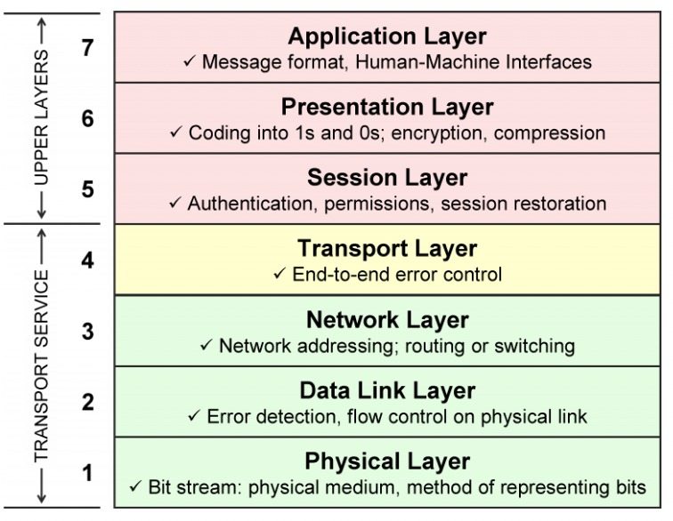
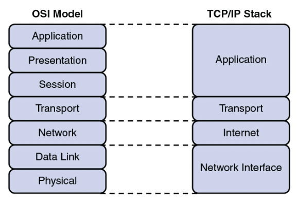
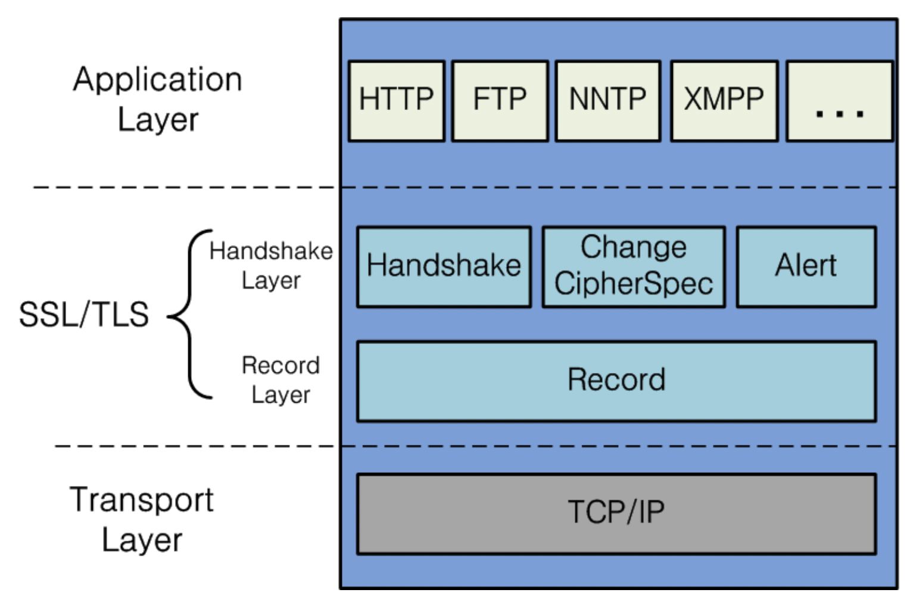

# OSI 7계층과 TCP/IP 4계층 모델
우리가 우리의 컴퓨터에서 다른 사람의 컴퓨터로 통신할 때, 네트워크 통신을 하게 된다. 
모드 컴퓨터는 네트워크 통신을 할 때 기본적으로 OSI 7계층 모델 혹은 TCP/IP 4계층 모델에 맞춰 동작한다.

## 네트워크 통신이 일어나는 과정
우리가 컴퓨터를 켠 뒤, 크롬브라우저를 열어 네이버 웹사이트를 접속한다고 하면 아래와 같은 흐름으로 통신이 이뤄진다.

1. 크롬 브라우저 검색창에서 `www.naver.com`을 입력
2. 크롬 브라우저는 이를 네트워크에서 통신 가능한 형태로 만든다.(보통 패킷이라 부름)
3. 이 패킷을 네트워크에 흘려 보낸다.
4. 네트워크 중간에 있는 기기(라우터)들이 이 패킷을 읽고 네이버 서버로 전달한다. 
5. 네이버 서버는 이 패킷을 다시 풀어, 웹서버가 읽을 수 있는 형태로 만들고 웹서버에 전달한다.  

여기서 중요한 점은, 우리는 단순히 사람이 이해할 수 있는 URL만을 입력했지만 내부적으로 패킷과 같은 특정 형태로 데이터를 만든다는 것이다. 또한 이렇게 만들어진 패킷은 수신받는 쪽에서 다시 사람이 이해할 수 있는 데이터로 만들어진다는 것이다.  

## 네트워크 통신을 osi 7계층 모델로 이해하기
위 과정을 `OSI 7계층 모델`이란 개념 위에서 표현하면 다음 그림과 같게 된다.  
  
위 그림에서 우리는 `송신호스트`가 되고 네이버 서버는`수신 호스트`가 된다.  
- 먼저 우리는 브라우저라는 `응용(애플리케이션 계층`에서 데이터(URL)을 입력한다.
- 이 데이터는 전송 전에 내부적으로 `표현 계층`, `세션 계층`, `전송 계층`, `네트워크 계층`, `데이터링크 계층`을 차례대로 지나며 네트워크 통신에 필요한 데이터를 기존 데이터에 추가한다.
    - 각 게층은 순서를 가지며, `응용 계층` -> `물리 계층` 순으로 전달 된다. 
    - 각 계층은 이전 계층으로부터 데이터를 전달받으며, 자신의 계층에서 필요한 데이터들을 기존 데이터에 추가로 붙인다.  
    - 데이터를 붙인다는 것은 예를 들어 어떤 IP로 전달할지 등의 정보를 더한다는 것이다.
- 물리 계층에서는 이렇게 계층을 지나며 만든 데이터를 실제로 네트워크에 전송한다.
- 네이버 서버는 이 데이터를 수신받아 다시 `물리 계층` ->`응용 계층`순으로 전달한다. 
    - 각 계층은 마찬가지로 이전 데이터로부터 데이터를 전달받으며, 필요한 데이터만 분리하여 해석한다.
- 최종적으로 `응용 계층`에서는 요청을 웹서버에 전달한 뒤, 웹서버는 송신자에게 필요한 응답(네이버 메인 페이지)를 다시 데이터로 만들게 된다.  

## 프로토콜이란

두 사람이 편지를 주고받는다고 해보자. 편지를 주고받으려면 누가 누구에게, 어디로 보내는지, 어떤 내용을 담을지에 대해 우체부에게 알려줘야 한다. 두 사람과 우체부는 이런 정보를 다음과 같은 형태로 남기자고 약속했다고 하면

```
FROM: 보내는 사람
TO: 받을 사람
ADDRESS: 받는 사람 주소
MESSAGE: 전달할 내용
```

이 형태를 사용하는 방법은 예를 들면 다음과 같다.

```
FROM: 그랩
TO: 하디
ADDRESS: 서울시 서울숲역 디타워 5층
MESSAGE: 하디, 잘 지내고 있나요?
```

이제 우체부는 위 내용을 보고 잘 이해한 뒤, 편지를 잘 전달해줄 수 있을 것이다.  


위 형태처럼 통신을 위해 형태 또는 규약을 `프로토콜`이라고 한다. 여기서는 두 사람과 우체부가 이 프로토콜을 사용했다고 할 수 있다. 네트워크에서는 많은 프로토콜이 있는데, 모두 데이터를 올바르게 전달하고 받기 위해 존재한다. 여러분이 익히 들어본 HTTP, TPC, UDP 가 바로 이러한 프로토콜의 대표적인 예시이다.  


## OSI 7계층 모델이란?

OSI 7계층이란 위에서 보았듯, 네트워크 통신의 과정을 7단계의 계층으로 나눈 설계를 의미한다. 이렇게 계층을 나누어 놓으면 무엇이 좋을까?

- 전체적으로 필요한 일을 여러 계층으로 나누면, 계층별 해야 할 일이 명확해진다.
- 전체적인 설계 모델이 있음으로써, 설명하기도 이해하기도 쉽다. 
- 각 층을 나누면 각 층별로 필요한 데이터들을 표준화할 수도 있다.  

OSI 7계층 모델은 국제표준화기구에서 개발한 네트워크 통신 표준 모델이다.  

> **OSI 7계층 모델의 탄생 배경**
>
> 1980년대 컴퓨터 통신망이 확산하면서 다양한 통신망들이 등장하고 더불어 매우 복잡해졌다. 이에 따라 기능별 분류의 필요성이 느껴지기 시작했는데, 통신망별 정보교환을 위한 별도의 절차를 마련하는 것은 비효율적이므로 다른 제조업자의 시스템이라도 네트워크 유형과 관계없이 상호 통신이 가능한 지침이 필요해졌다. 이에 컴퓨터 간의 네트워크의 필요성이 절실하게 대두되자 ISO(국제표준화기구)는 OSI7 계층이라는 새로운 네트워크 모델을 발표하게 된다.  


## 각 계층이 하는 일

  


- **계층 7: 응용 계층(Application Layer)**
  - 이 계층은 **웹 서비스의 UI부분, 사용자의 입출력(I/O)을 담당**한다.
  - 우리가 보통 개발하는 프론트 엔드, 백엔드 서버가 바로 이 레이어 위에서 동작한다.
  - 즉 대부분의 사람이 사용하는 웹 서비스는 이 레이어 위에서 제공된다고 생각하면 된다.
- **계층 6: 표현 계층(Presentation Layer)**
  - 응용 계층과 네트워크 계층을 위해 **계층 간 데이터를 적절히 표현하는 부분을 담당**한다.
  - 이미지를 압축한다든가, 데이터를 암호화한다는가 등의 기능이 이 레이어 위에서 동작한다.
- **계층 5. 세션 계층(Session Layer)**
  - 통신은 실제로 `세션`이라고 하는 단위 위에서 이루어지는데, 이 계층은 이러한 **통신 세션**을 구성한다.
- 계층 4. 전송 계층(Transprot Layer)
  - **컴퓨터로 들어온 네트워크 데이터를 어느 포트(어느 프로세스)로 보낼지 담당**한다.  
  - 하나의 컴퓨터에는 여러 프로세스가 동작하고 있으며 프로세스마다 별도의 네트워크 포트를 가지게 된다.   
    - 예를 들면 하나의 컴퓨터에 프론트엔드 애플리케이션은 `80`포트를, 백엔드 애플리케이션은 `8080`포트에 배포 할 수 있다. 
    - 네트워크 데이터가 들어오면, 이를 `80`포트(프론트엔드 애플리케이션)로 보낼지, `8080`포트(백엔드 애플리케이션)로 보낼지를 담당하는 것이다.  
  - 또한 네트워크가 끊기거나 데이터가 잘못된 것은 없는지 등 **신뢰성 있는 데이터를 보장하는 역할을 담당**한다.
- 계층 3. 네트워크 계층(Network Layer)
  - **IP주소를 사용하여 네트워크 데이터를 어느 컴퓨터로 보낼지 담당**한다.
    - IP 주소는 컴퓨터당 하나가 부여되지만, 중간에 바뀔 수 있으며 소프트웨어적으로 존재하는 개념이다.
  - 흔히 말하는 `라우터`라는 기계가 이러한 역할을 해준다.
- 계층 2. 데이터 링크 계층(Data Link Layer)
  - 네트워크 카드의 **MAC 주소를 사용해 네트워크 데이터를 어느 컴퓨터로 보낼지 담당**한다.  
    - MAC 주소는 랜카드당 하나가 존재한다.
    - 즉 IP 주소랑은 다르게 변하지 않으며, 하드웨어 자체에 포함되는 개념이다. 
- 계층 1. 물리 계층 (Physical)
  - 디지털 데이터를 아날로그적인 전기적 신호로 변환하여 네트워크 전선에 흘려보낸다.
    - 네트워크 전선은 `0101`과 같은 디지털 신호를 이해할 수 없다.
    - 따라서 이런 디지털 데이터를 네트워크 전선이 이해할 수 있는 아날로그 형태로 바꾼다.
  - 반대로 아날로그 신호를 디지털 신호로 바꾸는 역할도 한다.

## TCP/IP 4계층 모델이란?

사실 OSI 7계층 모델은 네트워크 통신 표준화를 위한 개념 모델이다. 즉, 실제로 인터넷 통신이 엃게 동작하지는 않고, 이렇게 계층을 나누어 통신하도록 설계하자는 국제표준화기구의 제안이라 생각하면 된다.  

<br/>   

**실제 대부분의 인터넷 통신은 IP와 TCP에 기반한 일명 TCP/IP 통신을 사용한다.** 그리고 이 통신에 특화된 네트워크 통신 계층 모델이 따로 존재하는데, 이걸 `TCP/IP 4계층 모델`이라고 한다. OSI 7계층과 유사하지만, 아래 그림의 오른쪽 그림처럼 4계층으로 간소화되어 있다.  

  

4계층이 각기 어떤 일을 담당하는지 간략히 알아보자. OSI 7계층 모델에 대해서 알았다면, TCP/IP 4계층 모델은 이해하기 쉽다. 

- 계층 4 : 응용 계층(Application Layer)
  - OSI 7계층 모델의 7,6,5(응용, 표현, 세션) 계층 기능을 담당한다.  
  - HTTP, Telent, SSH, FTP와 같은 프로토콜이 여기에서 사용된다. 
- 계층 3 : 전송 계층(Transport Layer)
  - OSI 7 계층 모델의 4(전송) 계층과 같다. 프로세스 간의 신뢰성 있는 데이터 전송을 담당한다.
  - TCP, UDP와 같은 프로토콜이 여기에서 사용된다.
- 계층 2 : 인터넷 계층 (Internet Layer)
  - OSI 7계층 모델의 3(네트워크) 계층과 같다. 컴퓨터 간 라우팅을 담당한다.
- 계층 1: 네트워크 인터페이스 계층 (Network Interface Layer)
  - OSI 7계층 모델의 2, 1(데이터 링크, 물리)계층과 같다. 네트워크 통신의 물리적인 부분들을 주로 포함한다. 


## HTTP vs HTTPS
HTTPS도 네트워크 하면 항상 나오는 주제이다. HTTPS가 무엇이고, OSI 7계층 레이어와 어떤 연관이 있는지 간략히 알아보자. 

먼저 HTTP는 Hyper Text Transfer Protocol의 약자로, 말 그대로 텍스트 문서를 주고 받기 위해 만들어진 프로토콜이다. 우리가 일상에서 사용하는 웹브라우저와 서버가 바로 이 HTTP를 사용하여 정보를 주고 받는다. 

  

HTTP는 보안에 취약하다. 그래서 통신 과정에도 응용 계층의 데이터를 암호화할 필요성이 느껴졌는데, 이로 인해 보안을 위한 레이어 SSL(Secure Sockets Layer, 현재는 TLS라는 명칭으로도 사용)가 생기게 된다. 해당 레이어는 응용 계층과 전송 계층 사이에 존재한다.  

이렇게 보안의 역할을 하는 SSL 계층을 기반으로 하는 HTTP 통신을 HTTPS라고 한다. 
HTTPS는 통신 보안을 포함하고 있으므로, 당연히 HTTP보다 더 좋다. 다만 내용을 암호화하고 복호화하는 로직이 추가되었으므로, 기존보다 통신 로직이 좀 더 복잡해진다.

## 정리
- OSI 7계층 모델
  - ISO가 발표한 네트워크 통신 표준 모델(개념 모델)
  - 각 계층은 저마다의 맡은 기능이 있으며, 사용하는 프로토콜도 다르다.
  - 각 계층은 직전 계층에서 데이터를 전달받으며, 필요한 데이터를 붙여서 다음 계층으로 보낸다. 
  - 즉 우리가 송신자면 7계층(L7) 부터 시작해 1계층(L1)까지 데이터를 만들어 보낸 뒤, 수신자는 다시 1계층부터 7계층까지의 과정을 거쳐 최종적으로 데이터를 받는다.
- TCP/IP 4계층 모델
  - TCP/IP는 우리가 보통 많이 쓰는 TCP/IP 통신에 기반한 네트워크 통신 모델이다.
  - OSI 7계층과 유사하지만, 4계층으로 간소화되어 있다.