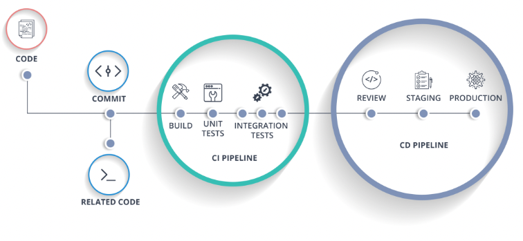

# 배포와 CI/CD

## 배포(Deployment)

프로그램(소스 코드)을 외부 환경에 설치하고 실행하는 일련의 과정을 `배포`라고 한다. 더 예를 들면, 새로운 모바일 앱을 앱스토어에 등록하는 것도 배포이다. 기존에 있던 웹 서비스를 업데이트하는 작업도 배포라고 할 수 있다. 

## 배포 방법의 변화

### 1. 직접 소스 코드 설치 & 실행

초기에는 서버에 직접 코드를 설치했다. 예를 들면 디스크나 CD, 지금으로 치면 USB 같은 디스크에 소스 코드를 담아, 서버가 있는 곳으로 가서 소스 코드를 직접 다운받아 실행시키는 것이다. 배포는 할 수 있으나, "**서버가 있는 곳까지 소스 코드를 들고 매번 가야 하는 불편함**"이 존재했다.

### 2. FTP나 원격저장소로 설치 & 실행하기

인터넷의 발달로 이제 인터넷을 통해 서버에 접속할 수 있게 되었다. 이제 직접 코드를 들고 컴퓨터가 있는 곳까지 가지 않고, FTP를 통해 서버에 소스 코드를 업로드한다. 또는 GitHub와 같은 코드 원격 저장소를 통해 작업한 코드를 업로드하고, 서버에서 다운받아 설치한다. 이후 서버에 접속하여 소스 코드를 실행시켜 배포한다. 

확실히 이전보다 편해 졌지만 서버가 여러 대인 경우, 이런 작업을 서버 개수만큼 해야하는 불편함은 여전히 존재했다. 또한 서버의 운영체제나 환경설정에 따라 내가 작성한 소스 코드가 실행되지 않는 일도 발생한다. 예를 들어 윈도우 환경에서 코드를 개발하고 테스트할 땐 문제가 없었는데, 서버의 운영체제인 리눅스에서 실행하면 문제가 발생하는 것이다.

한 서버에 여러 개의 서비스를 실행할 때도 문제가 된다. 예를 들어 서버에 A라는 서비스가 실행되고 있었다고 하면. B라는 서비스를 이 서버 위에 또 배포하고 싶어 B 코드를 설치한다. 이때 B를 설치하는 과정에서 A라는 서비스가 사용하고 있던 운영체제의 설정이 바뀌거나, 라이브러리가 바뀌는 부작용이 발생할 수 있다. 두 서비스는 독립적인 서비스인데, 같은 실행 환경을 공유하고 있기 때문에 이런 현상이 발생하게 된 것이다.

이 때문에 "**코드를 실행하는 환경**"과 "**배포의 독립성**" 이 중요한 이슈로 떠오르게 됩니다.

### 3. VM 위에서 배포하기

VM 등장 이후 이제 배포에 VM을 적극적으로 활용한다.  VM을 사용하면 윈도우 환경에서 개발해도, 실제 서버에 배포하기 전에 VM으로 리눅스 환경을 구축하여 이 위에서 실행을 테스트할 수 있게 된다. 그리고 서버에도 마찬가지로 VM을 사용하여 테스트했던 환경과 똑같은 운영체제 환경을 구축할 수 있다. 이를 통해 **코드를 실행하는 환경**을 일관되게 가져갈 수 있다.  

### 4. 컨테이너 기반(Docker)으로 배포하기

컨테이너느 VM이후에 등장한다. VM보다 가벼운 컨테이너 기술을 활용해 배포에 더 적극적으로 활용하게 된다. 현재 IT 회사에서 이뤄지는 대부분의 배포는 Docker를 통해 이뤄진다. 구체적으로 다음의 과정을 거친다.

1. 코드 개발을 완료한다.
2. 배포를 위해 Dockerfile 작성
3. docker build 명령어를 입력하여 Dockerfile을 읽어 이미지를 만듦
4. Dockerhub와 같은 이미지 저장소에 만든 이미지 업로드
5. 배포할 서버에 접속하여, 업로드한 컨테이너 이미지를 다운받은 뒤 `docker run {컨테이너 이미지 이름}` 으로 실행

Docker를 사용하면 VM보다 가벼우면서도 독립적인 실행화경을 갖출 수 있다. 또한 Dockerfile내에 실행하기 위한 모든 설정이 기록되어 있기 때문에,   Docker 문법을 아는 사람라면 쉽게 실행황경을 이해할 수 있고 재현할 수 있다. 

## CI/CD

Docker로 인해 이전보다 배포하는 속도가 빨라지고 더욱 자주 할 수 있게 되엇다. 하지만 더 자주, 더 빨리 배포하기위해선 배포 과정을 최대한 자동화하는 게 중요하다. 

- Docker 컨테이너 이미지를 빌드하는 과정
- 빌드된 이미지를 저장소에 업로드하는 과정
- 업로드한 컨테이너 이미지를 서버에서 다운받아 실행하는 과정

만약 위 과정이 자동화되면 팀원들이 더 빠르고 쉽게 배포를 진핼할 수 있게 된다. 에를 들어 작업한 코드를 우너격 저장소(Github)에 올리게 되면, 즉시 위 세 과정이 순차적으로 동작하도록 할 수 있다. gitbug에 개발한 코드만 올리면 바로 배포가 되는 것이다. 이를 `지속적 통합/지속적 배포(Contunous Integration / Continous Deployment)`, 일명 `CI/CD`라고 부른다.  

CI/CD 도구로는 `Jenkins`, `CircleCI`, `Travis`, `GitHub Action`, `BuddyWorks`와 같은 것들이 있습니다. CI와 CD를 하나의 도구로 사용하기도 하며, 경우에 따라서 분리하여 사용하기도 한다.

이러한 CI/CD 개념과 도구 덕분에 개발자들은 더욱 빠르게 배포할 수 있게되었고, 빠르게 배포 후 피드백을 받으니 개발 진척 속도도 더 빨라졌다.

## 정리 

- 배포는 내가 만든 작업물을 외부 환경에 공개하는 일이다.
- 배포 방법은 직접 설치, FTP나 원격저장소, VM을 거쳐 현재는 Docker를 사용하기까지 발전 과정이 있었다.
- 좀 더 자주, 빠른 배포를 위해 CI/CD 개념과 도구들이 생겨났다.
- CI/CD로 개발과 배포를 막힘없이 진행할 수 있다.  