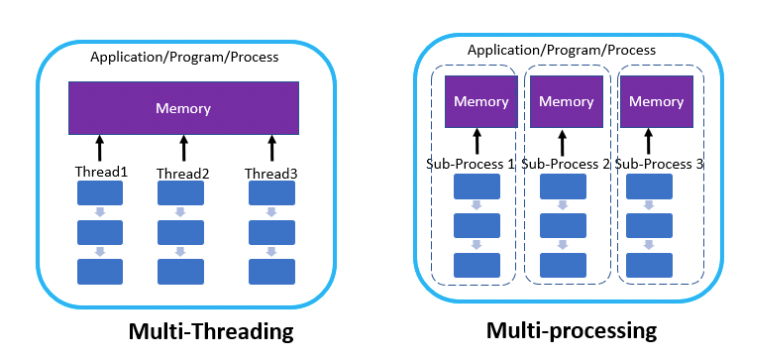

# 멀티 스레드와 멀티 프로세스

## 멀티스레딩

보통 작성하는 코드를 실행하면 하나의 프로세스는 보통 하나의 스레드만 사용하여 동작한다. 

```python
import os
import threading


def run() -> None:
    print(f"process_id: {os.getpid()}")
    print(f"thread_id: {threading.get_ident()}")

if __name__ == "__main__":
    run()
```
위 코드를 실행하면 아래 결과가 나온다.

```
process_id: 25939
thread_id: 4539137536
```
이렇게 하나의 프로세스에서 하나의 스레드만 사용하는 것을 `싱글 스레딩`이라고 한다. 우리가 작성하는 대부분의 코드들은 이렇게 싱글 스레딩이다.  

그런데 하나의 프로세스에서 여러 개의 스레드를 사용할 수도 있다.  

```python 
import os
import threading
from concurrent.futures import ThreadPoolExecutor


def run() -> None:
    print(f"process_id: {os.getpid()}")
    time.sleep(5)  # 5초 동안 대기합니다.
    print(f"thread_id: {threading.get_ident()}")


# run 함수를 실행하는 2개의 스레드를 띄웁니다.
if __name__ == "__main__":
    with ThreadPoolExecutor() as executor:
        n_threads = 2
        for _ in range(n_threads):
            executor.submit(run)
```
위 코드를 실행한 결과는 다음과 같다.

```python
process_id: 27180
process_id: 27180  # 같은 프로세스에서 생성했으므로, 프로세스 ID는 같습니다.

# (5초 뒤)

thread_id: 123145394302976
thread_id: 123145411092480  # 서로 다른 스레드이므로 스레드 ID는 다릅니다.
```
이렇게 여러 개의 스레드를 사용하는 것을 "멀티 스레딩"이라고 합니다.  
멀티 스레딩은 `동시성`과 `병렬성`을 구현하는 방법 중 하나이다. 컴퓨터가 하나의 CPU 코어만 가진 경우 `동시성`이 되고, 여러 개의 코어를 가진 경우 `동시성`과 `병렬성`이 둘 다 구현하는 세이 된다.   

멀티 스레딩을 사용하는 대표적인 경우는 독립적인 I/O Bounded 작업이 많은 경우이다.  

예를 들면 여러 사이트를 크롤링 해야하는 경우, 각 크롤링 작업 대부분 I/O (해당 서버에 요청하고 응답받기 때문) 작업이기 떄문에, 멀티 스레딩을 사용하기 좋다.  

## 멀티 프로레싱  
프로그램 실행에 2개 이상의 프로세스를 사용하는 것을 `멀티 프로세싱`이라고 한다.  파이썬 코드로 다음과 같이 구현할 수 있다.  
```python
import os
import threading
import time
from concurrent.futures import ProcessPoolExecutor


def run():
    print(f"process_id: {os.getpid()}")
    time.sleep(5)
    print(f"thread_id: {threading.get_ident()}")


if __name__ == "__main__":
    with ProcessPoolExecutor() as executor:
        n_processes = 2
        for _ in range(n_processes):
            executor.submit(run)
```
위 코드를 실행하면 다음과 같은 결과가 나온다. 

```python
process_id: 28394
process_id: 28393  # 서로 프로세스이므로, 프로세스 ID는 다릅니다.

# (5초 뒤)

thread_id: 4612054528
thread_id: 4766633472  # 서로 다른 프로세스 내에서 실행되고 있으므로 당연히 스레드 ID도 다릅니다.
```
멀티 프로세싱은 역시 `동시성`과 `병렬성`을 구현하는 방법 중 하나이다.  
컴퓨터가 하나의 CPU 코어만 가진 경우 `동시성`이 되고, 여러 개의 코어를 가진 경우 `동시성`과 `병렬성`이 둘 다 구현되는 셈이다.  

멀티 프로세싱을 사용하는 대표적인 경우는 독립적인 CPU Bounede 작업이 많은 경우이다.  

예를 들면 머신 러닝 코드에서 전처리하는 부분을 멀티 프로세싱으로 풀어 낼 수 있다.

## 멀티 스레드와 멀티 프로세스의 차이

- 멀티 스레드와 멀티 프로세스의 가장 큰 차이는, "메모리 공유" 이다. 멀티 스레드는 여러 개의 스레드가 하나의 프로세스 안에서 같은 메모리를 사용한다. 반면 멀티 프로세스는 각 프로세스가 별도의 메모리 공간을 갖는다.  
- 멀티 스레드는 멀티 프로세스보다 적은 메모리 공간을 사용하며, 스레드간 컨텍스트 스위칭도 빠르다. 하지만 같은 메모리에 있는 자원들을 공유하므로, **각 스레드에서 자원 관리에 주의해야 한다. 또한 하나의 스레드가 장애 시 전체 프로세스에 영향을 준다.** 
- 멀티 프로세스는 멀티 스레드보다 더 많은 메모리 공간을 차지하고, 프로세스간 컨텍스트 스위칭도 스레드에 비하면 느린 편이다. 하지만 각각의 독립적인 메모리 공간을 가지기에 자원 관리를 더 쉽게 할 수 있다. **따라서 스레드에 비하면 시스템이 전체적으로 안정적이다.**
- 보통 메모리를 공유해야 하며 간단하게 작업을 구현하고 싶은 경우 멀티 스레딩을 사용하고, 독립적으로 메모리를 가지고 안정적으로 관리하고 싶은 경우 멀티프로세싱을 사용하는 경우가 많다. 

