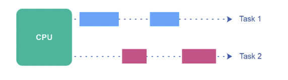
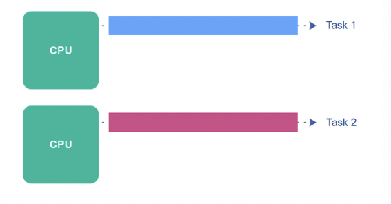
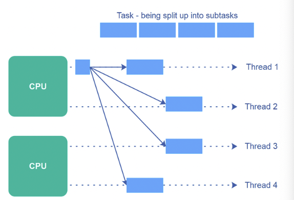

# 병렬성과 동시성

## 동시성

하나의 CPU를 최대한 활용하기 위해 동시성이란 개념이 나오게 되었다.  
동시성은 운영체제에서 구현되어, 하나의 CPU를 최대한 활용하여 여러 작업을 빠르게 수행한다. 
여전히 CPU는 한번에 하나의 명령어만 처리하지만, CPU가 맡는 프로세스(스레드)가 Block 상태과 되면 빠르게 다음에 처리해야 할 프로세스가 CPU를 점유하게 된다.  

   

CPU가 쉴 틈 없이 한 번에 주어진 태스크들을 빠르게 처리하다 보니 컴퓨터 사용자는 사실상 모든 프로세스의 명령이 `동시에` 처리된다고 느끼게 된다. 이렇게 진행되는 현상을 `동시성(Concurrency)`라고 부른다.  

## CPU Bound vs I/O Bound  
컴퓨터가 수행하는 하나의 작업은 CPU와 I/O 작업으로 이뤄진다. 이때 컴퓨터 작업을 크게 2가지로 나눠볼 수 있는데,  
하나는 `CPU Bounded Task`이고, 다른 하나는 `I/O Bounded Task`이다.  

- CPU Bound Task
    - 작업을 실행하는데 I/O보다는 CPU를 더 많이 쓰는 작업을 말한다. 예를들면 머신러닝과 같이 연산이 복잡한 로직이 여기에 해당한다.
    - I/O 작업이 아예 없는 것은 아니지만, 대체로 CPU 사용량이 더 압도적이다.  

- I/O Bounded Task
    - 작업을 실행하는데 CPU보다는 I/O가 더 많은 작업을 말한다. 예를 들면 크롤링, DB와 연결하는 로직등이 여기에 해당한다. 
    - 일반적으로 웹, WAS 서버는 I/O Bounded한 경우가 많다.  

## 병렬성

  

예전에는 불가능 했지만 이제 컴퓨터 하나당 2개 이상의 CPU를 가질 수 있게 되었다.  
CPU가 2개이므로 이제 우리는 동시에 2개의 명령어를 실행할 수 있다.  **이렇게 여러개의 작업을 동시에 진행하는 현상을 `병렬성(Parallelism)`이라고 한다.**  

 

**동시성**은 실제로는 하나의 명령을 빠르게 수행하지만 처리속도가 매우 빨라 여러 작업이 동시에 진행되는 것 처럼 **느껴지게** 해주었다면, 병렬성을 **실제로** 여러 개의 명령어를 동시에 실행하는 것이다.  
물론 운영체제가 여러 CPU를 골고루 쓰도록 매니징 해준다.  

  

또한 병렬성은 동시성을 품을 수도 있다. 여러 개의 CPU를 사용하면서 각각의 CPU에서 여러 태스크(스레드나 프로세스)를 실행시키려고 한다면 동시성을 구현한 것이다.  

