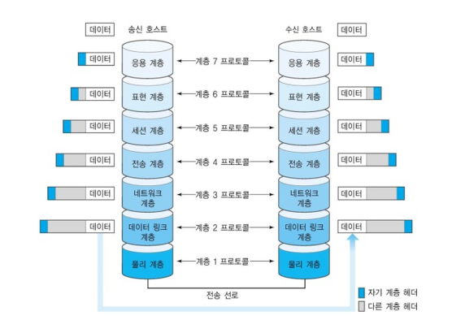

# 쿠키와 세선

우리가 자주 사용하는 HTTP 프로토콜의 특징으로 `비연결성(Connectionless)`과 `무상태성(Stateless)`이 있다.

비연결성은 한 번의 HTTP통신으로 요청과 응답이 오간 이후에 통신을 끊는다는 것이며, 이로 인해 통신과 관련된 상태는 남지 않는다(Stateless).  

예를 들어, 사용자가 로그인 요청을 한 뒤 응답을 받았다고 하더라도, 다음 요청에 이렇게 로그인된 정보는 통신 어디에도 남지 않는다. 따라서 서버 입장에서는 네트워크 요청이 왔을 때 이 요청이 어떤 사용자의 요청인지 알 수 없다. 

이렇게 상태 값을 가지지 않는 HTTP 통신 환경의 문제를 세션과 쿠키를 활용해서 해결할 수 있다.  


## 쿠키

쿠키는 웹 서버와 통신 과정에서 특정 정보를 저장하기 위한, key - Value 형태의 유효기간을 가진 데이터이다.  

1. 웹서버에서는 클라이언트(웹 브라우저)에게 특정 데이터를 남기고 싶을 때 응답 HTTP 헤더에 `Set-Cookie: 데이터`를 기록한다. 
2. 브라우저는 자동으로 HTTP 헤더의 쿠키 정보를 읽고 웹 서버의 도메인에 매칭해서 저장한다.
3. 나중에 웹 서버에 HTTP 요청을 날리게 되면 자동으로 쿠키를 헤더에 담아서 전송한다.  


쿠키는 도메인(웹 사이트) 별로 쿠키를 다양하게 둘 수 있다. 우리가 네이버, 쿠팡 등 다양한 도메인의 웹 서비스에서도 인증 정보나 장바구니 상태를 유지할 수 있는 건 도메인별로 쿠키가 유지되기 때문이다. 크롬 브라우저에서 개발자 도구 - Application 탭을 확인해보면 다음처럼 쿠키의 형태를 확인할 수 있다.  

   

쿠키는 보통 다음 처럼 사용된다.

- 서버 세션 관리
- 트래킹 (행동, 패턴 분석)
- 사용자 개인화

특히 인증/인가를 위해 자주 사용 된다.  


## 세션

세션은 클라이언트와 서버 간의 테느워크 연결에 대한 정보를 담고 있는 개체이다.  

세션은 서버 쪽에서 관리하는 객체로, 클라이언트와의 연결에 대한 정보를 담는다. 이때 세션을 저장하기 위해선 별도의 세션 스토리지를 구현하곤 한다.

일반적으로 세션을 사용해서 HTTP 통신을 하는 경우 아래와 같은 흐름을 따른다.

1. 클라이언트가 서버와 연결을 시도하면 서버는 해당 연결에 대한 정보를 세션 저장소에서 찾는다.
2. 세션 저장소에 정보가 존재하지 않는다면 새로운 세션을 만들고 저장한다.
3. 클라이언트에게 생성된 세션 정보를 쿠키 혹은 다른 방식으로 넘긴다.
4. 클라이언트는 해당 정보를 저장하고 있다가, 이후 요청에 세션 정보를 포함하여 요청을 보낸다.  

일반적으로 서버에서는 아래 예시처럼 세션을 관리할 때 ID로 관리하고, 접속 시간에 제한을 두곤한다. 

```Json
"session_id": {
    "user_id": "grab",
    "role": "Admin",
    "created_at": "2021-08-11 18:32:01",
    "expire_time": "2021-08-11 19:32:01",
}
```

세션은 일반적으로 사용자에 대한 식별이 필요할 때 사용한다. 로그인뿐만 아니라 동시 접속 탐지, 접근 기록 수집 같은 다양한 곳에 세션을 활용할 수 있다.  


## 세션과 쿠키의 차이

세션과 쿠키의 가장 큰 차이는, 인증에 대한 정보를 어디에 저장하느냐에 있다.  

쿠키는 이 정보를 클라이언트 쪽에 저장한다. 즉 인증 절차에 대한 모든 정보가 클라이언트에 저장한 쿠키에 있다. 

세션은 이 정보를 서버 쪽에 저장한다. 즉 모든 정보가 서버 쪽에서 관리하는 별도의 세션 저장소에 있다. 

> 세션과 쿠키는 서로 대립하는 관계가 아닙니다. 쿠키는 브라우저에 특정 데이터를 저장하는 방식이지만, 세션은 클라이언트/서버 구조에서 연결 정보(객체)를 저장하는 방식입니다.


## 정리

- 쿠키는 브라우저가 사용하는 임시저장소 중 하나로 Key-Value 형태로 데이터를 담는다.
- 세션은 클라이언트와 서버 간의 네트워크 연결에 대한 정보를 담고있는 객체로, 서버에서 생성하고 관리한다. 쿠키와 마찬가지로 보통 Key-Value 형태로 데이터를 담는다.
- 이 둘은 대립된 관계라기보단, 모두 활용하여 인증을 구현하게 된다.

