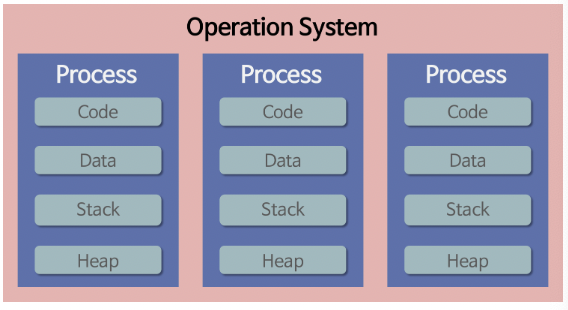

# 프로세스와 스레드 기본

## 프로세스

- 프로세스는 운영체제에 의해 연속적으로 실행되고 있는 프로그램이다.  
- 유저가 프로그램을 실행했다면 프로세스는 메모리 위에 올라가 있게 되며 운영체제에 의해 CPU, 메모리 자원을 할당받는다.
- 프로세스는 독립된 메모리 영역으로 `Code`, `Data`, `Stack`, `Heap`을 할당받는다.   
    - `Code` : 개발자가 작성한 코드
    - `Data` : 전역번수, 정적변수, 배열, 구조체등프로그램이 실행되면서 생기는 정적인 데이터
    - `Stack` : 함수 호출과 관련된 정보(실행정보, 지역변수, 파라미터 등) 일반적으로 컴파일 타임에 Stack의 크기가 결정됨.

    - `Heap`: 런타임에 동적으로 메모리를 처리해야 하는 상황에서 사용되는 공간.
        - Array를 사용하거나 외부 파일을 읽을 때 등을 예로 들 수 있다.
        - 사용자에 의해 메모리 공간이 동적으로 할당되고 해제될 수 있다.  

## 스레드

  

- 스레드는 특정한 시점에 프로그램의 작업을 수행하는 역할을 한다. 일반적으로 프로세스 안에서 실제 코드를 실행하는 단위라고 보면 된다.
    - 스레드는 CPU 이용의 기본 단위이다. 한 개의 스레드 작업은 1개의 CPU 코어에 할당되게 된다.
    - 스레드가 실행되기 위해선 자원(함수 실행 정보, 지역 변수 등)을 저장할 메모리가 필요하며, 이는 프로세스가 할당받은 메모리를 사용한다.  

- 스레드는 프로세스 내에 존재하기에 프로세스의 자원을 공유하게 된다. 각자의 스레드는 Stack을 별도로 가지고 있게 되며 나머지 자원(Code, Data, Heap)을 공유한다.  
