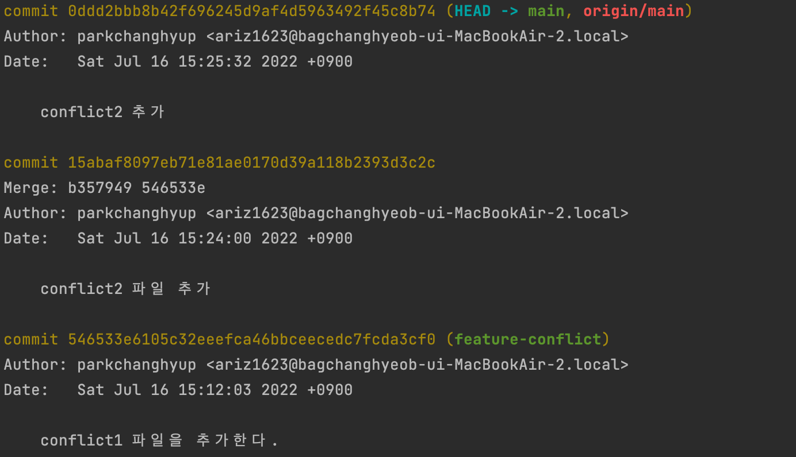
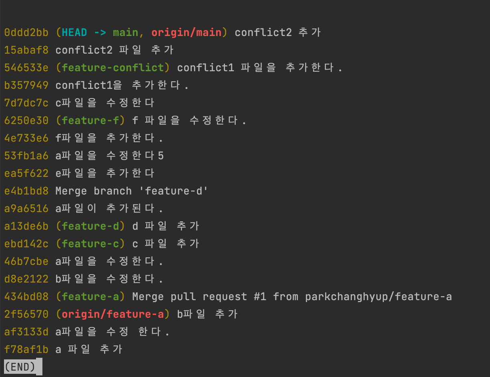
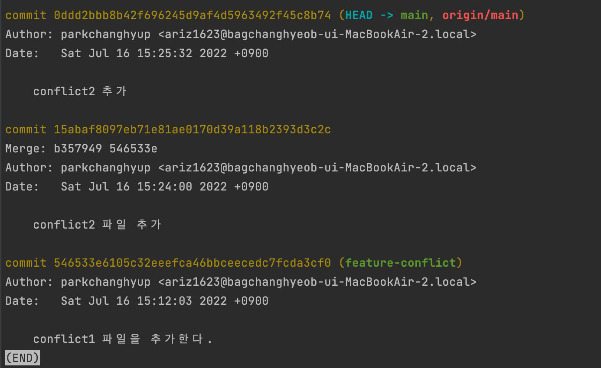
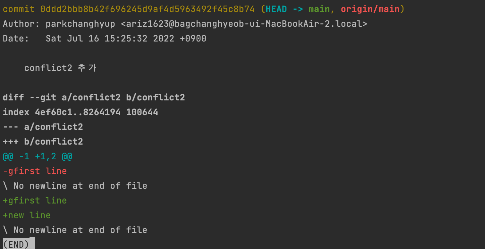
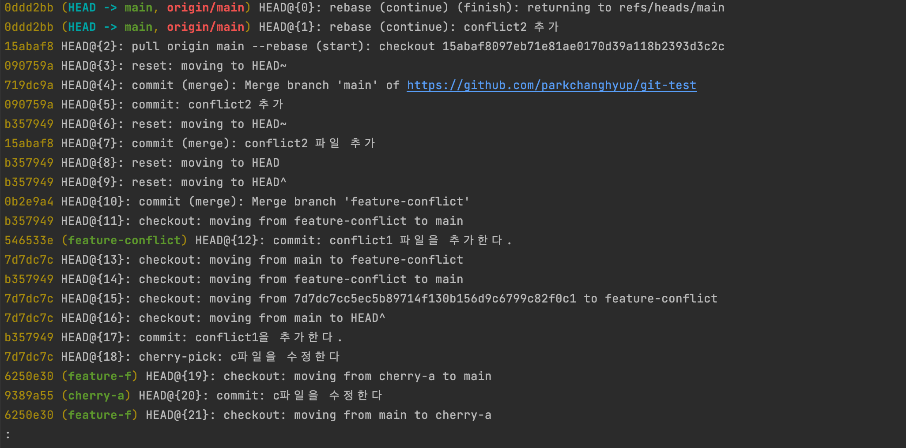
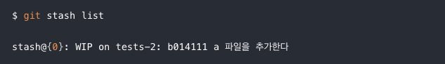
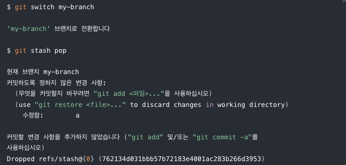

# 깃애서 자주 사용하는 명령어

## log & reflog


> ### TIP  
>`HEAD`는 커밋 내역에서 현재 커밋(보통 가장 최신 커밋)을 가리키는 포인터이다.  보통 명령어에 커밋 ID 대신 HEAD 포인터를 많이 활용한다.  
HEAD의 이전 커밋들을 확인하고 싶을 땐 HEAD^ 혹은 HEAD~로 포인팅이 가능하다.  

### git log 
```
$ git log 
```

커밋 내용을 확인하는 가장 일반적인 방법



```
$ git log --oneline
```
로그를 간략하게 출력하는 옵션

  

```
$ git log -n 3  
```
특정 갯수를 보고싶을 때는 -n 플래그 활용  




### git show
```
$ git show  
```
가장 최근 커밋 정보 확인 가능  



### git reflog  
```
$ git reflog  
```
`git reset`, `git rebase` 명령어로 삭제된 커밋을 포함한 모든 커밋 히스토리를 볼 수 있음.   




## restore & reset  

### git reset
```
$ git reset --hard {커밋ID}  
```
특정 커밋으로 돌아갈 때, 해당 커밋 이후 만들어진 모든 작업물을 삭제한다  
```
$ git reset --mixed {커밋ID}   
```
특정 커밋 시점으로 돌아갈 때, 해당 커밋 이후 모든 작업물은 `workspace` 공간에 unstaged 상태로 남게 된다.  
```
$ git reset --soft {커밋ID}  
```

특정 커밋 시점으로 돌아갈 때, 해당 커밋 이후 모든 작업물들은 `index`공간에 staged로 남게 된다.  

### git resotre
```
$ git restore {파일경로}  
```
특정 파일의 변경사항을 제거하고 HEAD 기준으로 되돌리고 싶을 때, resotre를 사용할 수 있다.   

>### TIP
> `git restore`는 `git reset --hard HEAD`와 비슷한 결과를 낸다.
다만 restore는 새 파일의 변경사항을 되돌리지 않지만, reset은 새 파일의 변경사항도 되돌립니다.


## stash
```
$ git stash  
```
git stash는 수정 내용을 임시 저장하는 명령어이다.  


main 브랜치로부터 my-branch 를 만들어 이 브랜치로 전환해서 작업하고 있었다고 해보자. 작업 도중 잠깐 다시 main 브랜치로 전환해야 할 할 일이 생겼다면,
이때 변경사항을 커밋으로 남기기에는 아직 진행중이라 애매한 상황이라면 임시 저장을 하는 git stash를 활용하면 된다.  
```
$ git stash list  
```

이렇게 stash 한 내역을 다음 처럼 git stash list로 확인할 수 있다.  


```
$ git stash  pop
```
main 브랜치에서 해야 할 일을 다 마치고 이제 다시 my-branch로 돌아가 작업을 진행할때, 브랜치를 이동 후 git stash pop 명령어로 아까 스택에 넣었던 작업 내역을 다시 불러오면 된다.  


```
$ git stash  apply    
```

git stash pop과 비슷한 명령어로 `git stash apply` 가 있는데, 이 둘의 차이점은 스태시한 내역을 저장하는 스택 공간에서 내역을 제거하는지 여부이다.  

`git stash pop`의 경우 스택에서 작업 내역을 제거합니다. 따라서 git stash list 로 해당 작업이 빠져있는 것을 확인할 수 있습니다.

반면 `git stash apply` 의 경우 스택에서 작업 내역을 빼지 않는다. 따라서 git stash list 로 봐도 작업 내역이 그대로 남아있는 것을 볼 수 있다. 여전히 스택에 남아있기 때문에 다른 곳에서 넣어둔 작업내역을 재사용 가능하다. (여러 곳에서 apply 가능하다는 의미이다.)

## revert
```
$ git revert {커밋ID}  
```
중간에 있는 커밋의 변경사항만 되돌리기 위해 사용된다. git reset과 달리 기존 커밋들을 지우기 않고, 현재 커밋 위로 이전 커밋 내용을 다시 되롤리는 커밋을 만든다.  


## amend commit % rebase   

- 현재 작업 중인 커밋(HEAD)을 간단하게 수정할 때 `git commit --amend`를 사용한다.  
- 아래에 있는 커밋들 중 일부를 수정하거나 변경할 때 `git rebase --interacitve`를 사용한다.  

>### TIP  
> git revert 같은 경우는 대상 커밋을 되돌리는 새로운 커밋을 만드는 기능이며, 커밋 자체를 변경하지는 앟는다.  

```
$ git commit --amend  
```
`--amend`는 현재 커밋(HEAD) 위에 변경사항을 덮어씌울 때 사용하는 옵션이다.   
커밋을 한 후 추가적인 변경사항이 생겼거나 커밋 메시지를 변경하고 싶을 때 많이 사용한다.  

만약 변경사항을 추가하고 싶다면 commit을 할때와 마찬가지로 stage에 올린 후 명령어를 입력하면 된다.  


```
$ git commit --amend --no-edit    
```
커밋 메시지의 수정을 필요로 하지 않는 경우 `--no-deit`옵션을 붙여주면 된다.  
```
$ git rebase --interactive {커밋 ID}    
```
git rebase 명령어는 브랜치 병합 과정에서 자주 사용된다.  하지만 동시에 과거 커밋 히스토리를 변경할 수 있는 기능도 `--interactive`옵션을 통해 제공한다.  

커밋 히스토리 수정 범위는 현재 최신 커밋부터 {커밋ID} 바로 위 커밋 까지 적용된다.  

## squash & rebase merge 

두 브랜치를 합치는 방법에는 크게 3가지가 있다.  

- 기본 Merge
- Squash & Merge
- Rebase & Merge  
```
$ git merge {브랜치 이름}  
```
git merge는 가장 기본적인 머지 방식이다.  
```
$ git merge {브랜치 이름} --squash   
```
별다른 머지 커밋을 만들지 앟고 변경 사항만 병합하고 싶을때 사용 하는 방식이 Squash & Merge 방식이다.  

```
$ git rebase {브랜치 이름}    
```
Rebase & Merge 방식은 merge 할 때 merge 커밋 을 남기지 않으면서도, merge 되는 브랜치의 모든 커밋 내역을 그대로 가져오는 머지입니다. 명령어는 git rebase 입니다.

## cherry-pick  
```
$ git cherry-pick {커밋 ID}  
```
cheery-pick 는 다른 브랜치의 작업 내역을 현재 브랜치로 가지고 오고 싶을 때 사용 합니다.  
