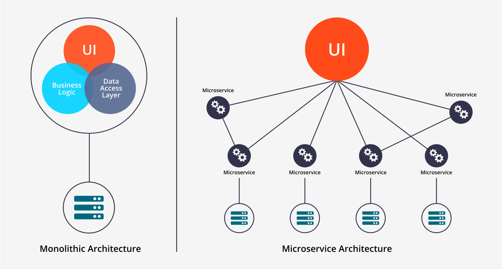
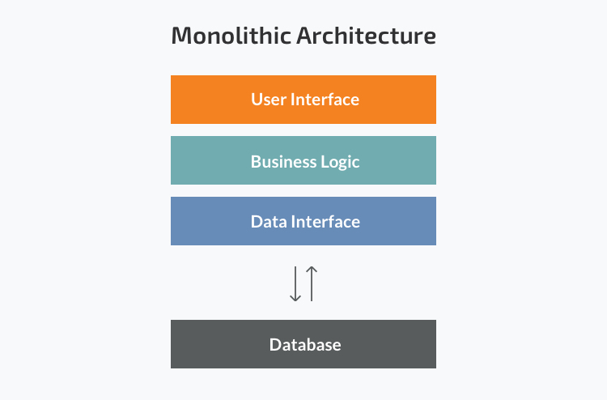
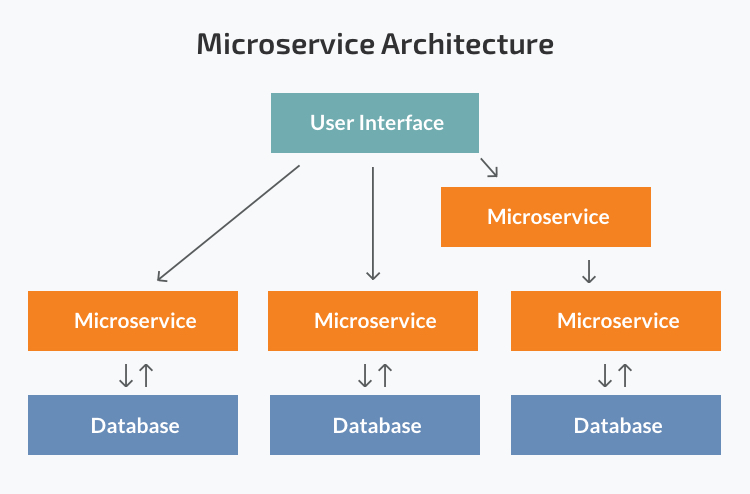

# 모놀리스와 마이크로서비스 아키텍처

  

모놀리스와 마이크로서비스는 모두 소프트웨어 아키텍처 패턴을 일컫는 개념이다.  
특히 비교적 최근 마이크로서비스 아키텍처의 등장으로 두 패턴은 자주 비교된다. 살펴보면 두 패턴은 각자 상반된 장단점을 가지고있다. 


## 모놀리스아키텍처
### 개념
모놀리스(Monolith)아키텍처는 **하나의 소프트웨어를 구성하는 모든 모듈과 코드를 한 프로젝트에서 관리하는 것**을 말한다. 애플리케이션을 기동하려면 이 단일 프로젝트만 실행시키면 된다.  

  

### 예시
모놀리식 아키텍처로 개발하는 구체적인 예시를 살펴보자. 우리가 쇼핑몰 웹사이트를 위한 백엔드 서버를 간단하게 만들어 본다고 하자. 프로젝트 구조는 다음과 같은 모양을 띌 것이다.  

```
app/
  domain/
    users/
      model.py
      repository.py
    products/
      model.py
      repository.py
    payment/
      model.py
      repository.py
  service/
    user_service.py
    product_service.py
    payment_service.py
  controller/
    user_controller.py
    product_controller.py
    payment_controller.py
  main.py
  config.json
```
서버를 구성하기 위한 모든 모듈과 코드가 `app/` 내에 존재한다. 즉 하나의 프로젝트 안에 담긴다. 또한 이 서버를 기동하기 위해서는 `main.py`만 실행시키면 된다.  

모놀리스 아키텍처는 이렇게 단순하며 전통적인 우리 상식에 들어맞는 아키텍처 패턴이다.  

### 장단점  
모놀리스 아키텍처로 소프트웨어를 구성하면 다음과 같은 점이 좋다.  
- 한 프로젝트 내에 모든 모듈과 코드가 있으므로 개발이 간단하고 리뷰가 용이하다.
- 소프트웨어 구조가 비교적 단순해서 애플리케이션을 구성하는 큰 그림을 보는데 편리하다.  
- 애플리케이션 기동에 `main.py`만 실생시키면 되므로, 배포하기 쉽다. 
- 디버깅이나 비교적 장애 대응이 비교적 쉽다.  

하지만 다음과 같은 한계를 가진다.
- 애플리케이션 코드가 점점 많아지고 서비스가 확장되면 전체 구조나 코드 흐름을 쉽게 이해하기 어렵다. 
- 한 프로젝트 내에 있는 코드이므로, 모든 코드가 결합되어 있다. 이 때문에 코드 변경이 두렵고 확장하기 어려워 진다.  
- 위와 같은 이유로 개발 속도도 느려진다. 코드를 작성하려면 전체 코드를 다 이해해야 하기도 한다.  
- 한 번에 테스트해야 할 양도 점점 늘어나 테스트 속도가 매우 느려진다. 빌드 역시 마찬가지다. 
- 최신 기술 스택이 나와도 쉽게 도입하기 어렵다. 모든 코드에 영향이 가기 때문이다. 

보통 기능 개발과 속도가 중요한 사업 초기에는 애플리케이션을 모놀리스 아키텍처로 구성한다.  


## 마이크로서비스 아키텍처
### 개념
마이크로서비스(Microservice) 아키텍처는 하나의 소프트웨어르 구성하는 컴포넌트들을 독립적인 프로젝트로 분리하여 관리하는 것을 말한다.   
이 각각의 컴포넌트들을 마이크로 서비스라고 부를 수 있다. 개발과 배포도 이렇게 분리된 마이크로서비스 단위로 진행한다.   
즉 하나의 소프트웨어가 정상적으로 동작하기 위해서는 이를 구성하는 각각의 마이크로서비스가 모두 정상 작동해야 한다. 이러한 방식은 보통 소프트웨어가 커지고 복잡해질 때 필요하다.

  

### 예시
위에서 예시로 든 쇼핑몰 웹사이트 백엔드 서버를 구성하면 다음처럼 된다. 
  

먼저 쇼핑몰 웹 사이트 백엔드 프로젝트는 크게 다음처럼 3가지 도메인으로 나눌 수 있다.

- 사용자 관련 도메인(Users)
- 상품 관련 도메인(Products)
- 결제 관련 도메인(Payment)  

프로젝트도 각 도메인에 맞게 3가지로 나뉘게 된다. 

```
# Users
app/
  domain/
    model.py
  service/
    user_service.py
  controller/
    user_controller.py
  main.py
  config.json
```

```
# Products
app/
  domain/
    model.py
  service/
    product_service.py
  controller/
    product_controller.py
  main.py
  config.json
```

```
# Payment
app/
  domain/
    model.py
  service/
    payment_service.py
  controller/
    payment_controller.py
  main.py
  config.json
```
세 가지 도메인은 각각 다른 프로젝트에서 개발되고 배포됩니다. 즉 `Users`, `Products` , `Payment` 프로젝트에서 각각 `main.py` 로 서버를 기동하고, **서버 3개가 동시에 떠있는 상태여야 쇼핑몰 웹사이트 백엔드 시스템이 정상적으로 동작**한다고 할 수 있습니다.  

마이크로서비스 아키텍처는 모놀리스보다 조금 더 복잡하고 해야 할 일도 많은 듯 하지만, 전체 서비스가 복잡해질수록 서비스 개발과 배포를 빠르게 진행할 수 있는 장점이 뚜렷해진다. 또한 각 마이크로서비스 별로 프로그래밍 언어(파이썬, 자바 등)이나 데이터베이스(MySQL, MongDB 등)를 따로 사용하는 등 기술 스택을 더 자유롭게 가져갈 수 있다.  

### 장점

- 각 마이크로서비스가 모놀리스보다 작은 규모이기 때문에 마이크로 서비스별로 보면 코드 구조나 흐름을 이해가기 쉽다.
- 전체적으로 분리가 되어있기 때문에 마이크로서비스간 결합이 강하지 않다. 각 서비스별로 수정이나 확장을 시도하기 편하다.
- 위와 같은 이유로 개발속도가 빨라진다. 특히 각 마이크로 서비스를 담당하는 전담 팀이 있을 때 더욱더 그렇다.  
- 한 번에 테스트할 양도 마이크로서비스 단위로 나뉜다. 테스트와 빌드, 배포 속도가 빨라진다. 
- 마이크로서비스별로 사용할 컴퓨팅 리소스(cpu, memory, etc)를 다르게 줄 수 있다. 또한 서버 개수도 다르게 둘 수 있다. 이는 요청 증가에 따른 서버 확장에 용이하다.  
- 기술 스택도 각 마이크로서비스 별로 다르게 가져갈 수 있다. 에를 들어 `Users` 서버는 Java, `Products`는 파이썬, `Payment`는 JS로 개발할 수 있다. 이처럼 각 마이크로서비스는 독립적인 환경에서 개발되기 때문에 기술 도입이 유연해진다.  

### 단점

- 각 서비스들이 분산되어 있기에 여러 연관된 서비스를 통합하여 테스트할 때 난이도가 높아진다. 
- 처음에 어떤 기준으로 마이크로서비스를 나눌지 결정하는 것이 어렵다. 잘못 나누면 마이크로서비스간 결합도는 높아지고 관리 비용이 늘어날 수 있다. 
- 각 담당 팀에서 마이크로서비스만 집중해서 개발하다보면 서비스의 전체 큰 그림을 파악하기 어려울 때가있다. 이런 큰그림과 흐름을 파악하기 위해 커뮤니케이션 비용이 들어간다. 
- 여러 서비스에 걸친 분산 트랜잭션 처리 등 분산 시스템 환경에서 고민할 문제들이 많다.  


