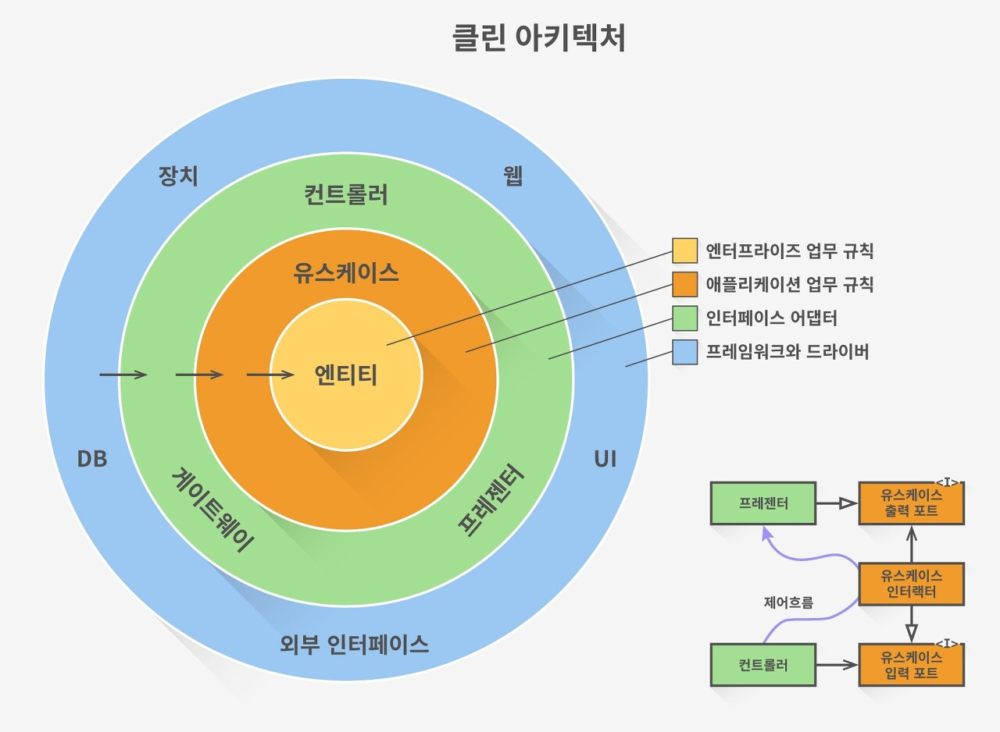
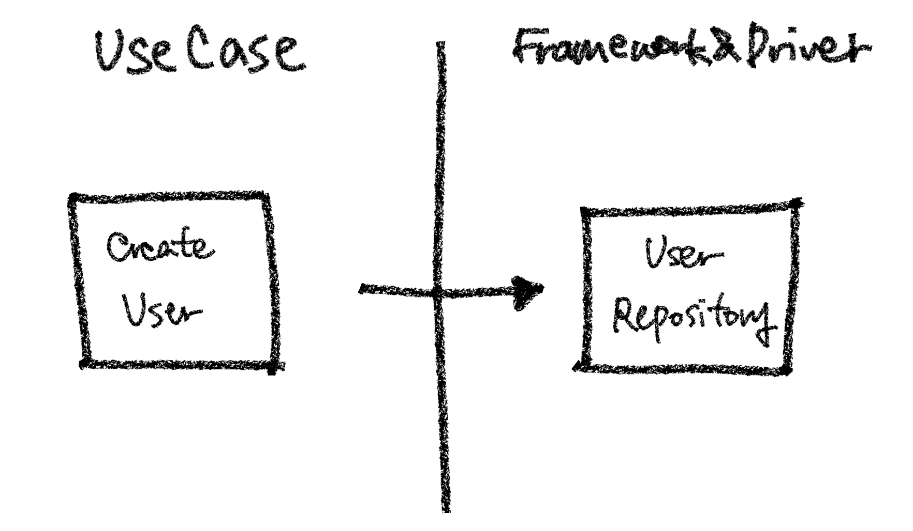
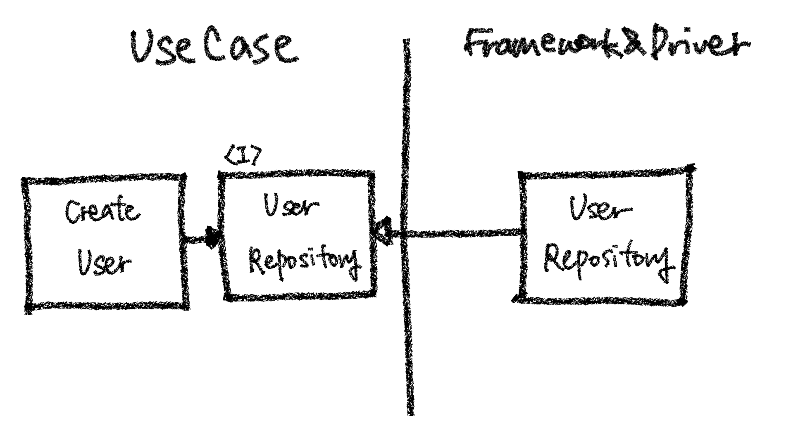

# 클린 아키텍처

## 개요 
아키텍처란
- 좋은 아키텍처는 시스템을 **쉽게 이해하고, 개발하며, 유지보수하고, 배포) 할 수 있게 한다.
- 아키텍처는 시스템의 **동작 여부 자체**와는 거의 관련이 없다.  
- 아키텍처는 소프트웨어를 **유연하고 부드럽게** 구조화 한다.  
- 좋은 아키텍트는 시스템의 **핵심적인 요소(정책)를 식별**하고, 동시에 세부사항은 이 정책에 무관하게 만들 수 있는 형태로 시스템을 구축한다. 
- 좋은 아키텍트는 **세부사항에 대한 결정을 가능한 한 오랫동안 미룰 수 있는 방햐응로 적책을 설계현다.  

클린 아키텍처는 이러한 내용을 고려해서 엔터프라이즈 애플리케이션에서도 적용될 수 있도록 만들어진 아키텍처 패턴이다.  

클린 아키텍처의 핵심적인 내용을 정리하면 다음과 같다.  
1. 세부 사항(DB, 프레임워크)가 정책(업무 규칙)에 영향을 주면 안된다.  
2. 계층별로 관심사를 명확하게 분리하여 변경이 필요할 때 영향을 주는 부분을 최소화한다. 
3. 내부 계층이 외부 계층을 의존하지 않아야 한다.(의존성 흐름은 바깥에서 안으로)

## 형태 
앞서 소개한 아키텍처들과 마찬가지로, 클린 아키텍처 역시 관심사 단위로 레어이를 나눈다.    
  

- **엔티티**
  - 핵심 업무 규칙을 캡슐화한다.
  - 메서드를 가지는 객체 거나 일련의 데이터 구조와 함수의 집합일 수 있다.
  - 가장 변하지 않고, 외부로부터 영향받지 않는 영역이다.
- **유스 케이스**  
  - 애플리케이션에 트고하된 업무 규칙을 포함한다.
  - 시스템의 모든 유스 케이스를 캡슐화하고 구현한다.  
  - 엔티티로 들어오고 나가는 데이터 흐름을 조정하고 조작한다.  

- **인터페이스 어댑터**
  - 일련의 어댑터들로 구성된다. 
  - 어댑터는 데이터를(유스 케이스와 엔티티에 가장 편리한 형식) <-> (데이터베이스나 웹 같은 외부 에이전시에 가장 편리한 형식)으로 변환한다.
  - 컨트롤러(Controller), 프레젠터(Presenter), 게이트웨이(Gateway)등이 여기에 속한다.  
- **프레임워크와 드라이버**
  - 시스템의 핵심 업무와 관련 없는 세부 사항이다. 언제든 갈아 끼울 수 있다. 
  - 프레임워크나, 데이터베이스, 웹서버 등이 여기에 해당하낟.  

  레이어는 상황에 따라 4가지 이상일 수 있다. 
  핵심은 안쪽 영역으로 갈수록 추상화와 정책의 수준이 높아지고, 반대로 바깥쪽 영역으로 갈수록 구체적인 세부사항으로 구성된다는 것이다.  
  안쪽 영억으로 갈수록 고수준이라고 하며,바깥쪽으로 갈수록 저수준이라고 한다.  

  ## 의존 방향 규칙
  의존성 방향은 항상 저수준에서 고수준으로 흘러야 한다. 즉 바깥쪽 원에서 안쪽 원으로 의존성이 있어야 한다는 것이다.  
  그러나 실제로 애플리케이션이 동작할 때는 제어 흐름은 이런 흐름과는 반대이다.  
  예를 들어, `유저 생성하기` 서비스는 유저를 저장하기 위해 유저 DB에 연동된 리포지터리를 사용할 것이다. 
  서비스는 `유즈케이스 영역`이고,  리포지토리는 `프레임워크&드라이버(인프라스트럭처) 영역`이므로, 유즈 케이스 영역에서 프레임워크&드라이버로 실행 흐름이 생기게 됩니다. **고수준이 저수준에 의존하고 있는 것이므로, 이는 `의존성 역전 원칙`을 위반한다.**  

  
클린 아키텍처에서는 이런 의존성 방향을 제어하기 위해, `의존성 역전`원칙을 지킨다. 즉 추상화된 인터페이스를 고수준 레이어에 두고, 이 인터페이스를 사용한다. 그리고 저수준에서는 이 인터페이스를 상속받는 객체를 구현한다. 이렇게 하면 고수준 컴포넌트가 저수준 컴포넌트에 의존하게 되지 않고, 반대로 저수준 컴포넌트가 고수준 컴포넌트에 의존하게 된다 .
  